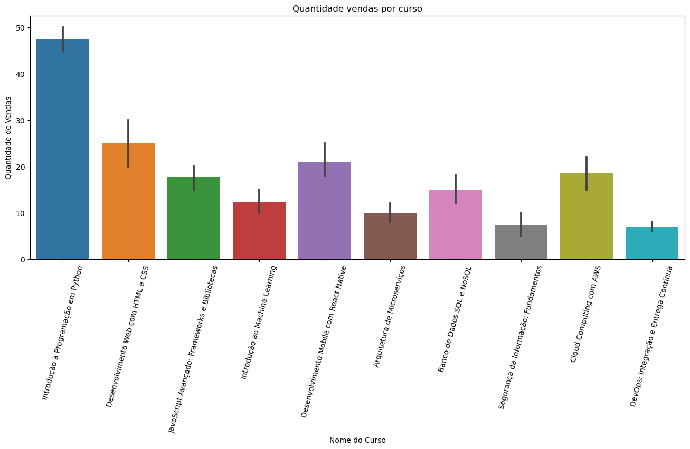
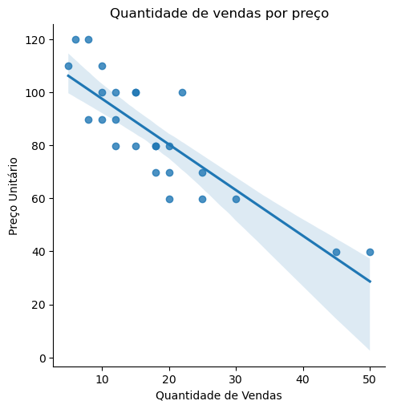

# Análise Exploratória de Dados

Este projeto de análise de dados foi  como parte da trilha inicial de Ciência de Dados.

## Stack utilizada

 * `Python: ` Linguagem de programação para criar os scrips das análises 
 * `Pandas: `  Biblioteca de software criada para a linguagem Python para manipulação e análise de dados
 * `Matplotlib: ` Biblioteca de software para criação de gráficos e visualizações de dados em geral
 * `Seaborn: ` Biblioteca de software para criação de gráficos e visualizações de dados em geral

## Sobre o projeto

Para executar o projeto você pode utilizar o jupyter nootebok ou rodar no vscode. As análises são feitas por celulas separadas.

## Análise

Além dos requisitos funcionais do projeto, foi desenvolvido as seguintes análises:  
` Receita total: ` 
```python
# Calculo faturamento e adicionando nova coluna no dataframe com o resultado
faturamento = df['Preço Unitário'] * df['Quantidade de Vendas']

df['Faturamento'] = faturamento
display(df)


# Somando o valor total do faturamento
soma_faturamento = df['Faturamento'].sum()

print("A soma do faturamento foi: R$", format(soma_faturamento,'.2f'))
```
 ` Curso com o maior número de vendas: ` 
 ```python
# Buscando maior venda
curso = df.groupby('Nome do Curso')['Quantidade de Vendas'].sum().idxmax()
print(f"O curso com mais vendas é o: {curso}")
```
 ` Vendas ao longo do tempo: ` 
 ```python
# Gráfico de barras mostrando vendas ao longo do mês de janeiro
plt.figure(figsize = (16,6))
sns.barplot(data = df,
            x = 'Data',
            y = 'Quantidade de Vendas').set(title = 'Vendas ao longo do mês de janeiro')
plt.xticks(rotation = 80)
plt.show()
```
 

## Visualização dos dados




## Autor
Desenvolvido por Tiago Alberto

- <a href="https://www.linkedin.com/in/tiago-alberto-303909167/" target=”_blank”>LinkedIn</a>
